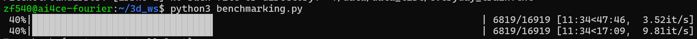
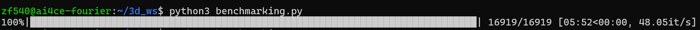

# Folder to HDF5 Conversion

This guide will help you convert a folder to an HDF5 file using `folder2hdf5.py` and provide an example of how to use the resulting HDF5 file with a PyTorch dataset.

[HDF5](https://en.wikipedia.org/wiki/Hierarchical_Data_Format) is a highly optimized dataset file format that's optimized for HPC workload. It can greatly speed up your IO performance.


For the same dataset of about 70 GB on disk:

Before HDF5:

Dataset is 70GB

After HDF5:

Dataset is 17GB

## `folder2hdf5.py`

1. **Install required packages**:
    ```sh
    pip install h5py
    ```

2. **Run the conversion script**:
    ```sh
    python folder2hdf5.py
    ```
    1. Make sure to change the input folder and output hdf5 name accordingly.

    2. You can play with the `create_dataset` chunks and compression parameters to achieve varying degree of effect. There are a lot of parameters to tune in general and the example here are just some standard stuff.

    2. The example given here are converting a mesh dataset. Because one mesh is not made of one single numpy array (such as an image) but rather a combination of two or more numpy arrays as faces and vertices, one mesh will be converted to a HDF5 `group`, with two HDF5 `datasets`. One for faces and one for vertices.
        - So, if your dataset is an image dataset, then you can convert it directly to a HDF5 `dataset`, instead of a HDF5 `group`.
        - If you are not sure about the definition of HDF5 `group` and HDF5 `dataset`, please checkout HDF5's official tutorial.

## PyTorch Dataset Sample

`breakingbad_hdf5.py` is a sample PyTorch dataset showcasing how to use the generated HDF5 file. Please checkout the `_read_objs_from_h5` function.
